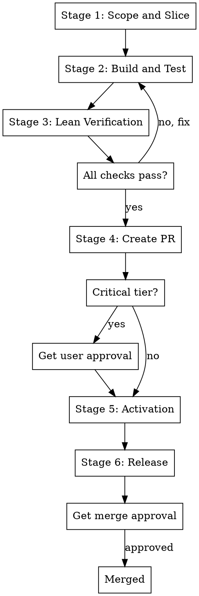

# PR Engineer (Fast to Production)

Ship production-ready code fast with AI while keeping quality, safety, and reviewability high.

## Priority Order (Strict)

When tradeoffs conflict, resolve in this exact order:

1. **Quality** (highest)
2. High number of PRs per week
3. Simplicity
4. No unnecessary changes
5. Backward compatibility for additions

**Rule:** Lower-priority goals must never reduce a higher-priority goal.

## Non-Negotiable Rules

- **Quality first:** Merged code must pass required tests and checks
- **TDD always:** Write tests before implementation code. No exceptions. (See superpowers:test-driven-development)
- **Plan non-trivial work:** For 3+ steps or architecture decisions, enter plan mode
- **Semantic commits:** One logical change per commit with concise title + mandatory body
- **No history rewriting:** `rebase`, `commit --amend`, force push forbidden for implementation commits
- **No unapproved merges:** Do not merge any PR without explicit user approval (PRs can be opened autonomously)
- **No committed workflow docs:** Workflow-generated Markdown artifacts must not be committed
- **No premature activation:** Non-final PRs must not expose runtime-visible functionality
- **Root-cause fixes:** Prefer root-cause fixes over temporary patches
- **Minimal changes:** Keep changes minimal; avoid broad/unnecessary edits
- **Backward compatible:** New additions must be backward compatible by default
- **Autonomous execution:** Proceed without pausing for decisions in autonomous categories

## Autonomous Operation

**Run without user intervention.** Make decisions autonomously based on codebase patterns and best practices. Do not wait for feedback or approval unless the decision falls into a MUST-ask category.

### Core Principle

**Execute, don't ask.** The default is autonomous action. Only pause for decisions that genuinely require human judgment.

### Iron Rules

1. **Blanket permission does not override MUST-ask categories** - "Decide everything" still requires asking about user-facing behavior, security, APIs, and architecture
2. **No false hesitation** - If you CAN decide autonomously, DO IT. Don't ask "just to be safe"
3. **Document, don't wait** - Note your reasoning and move forward

### Autonomous Decision Categories

**DECIDE WITHOUT ASKING:**

| Category | Examples |
|----------|----------|
| **Codebase patterns** | File structure, naming, error handling, logging, test patterns |
| **Implementation details** | Variable names, method signatures, internal logic within slice scope |
| **Standard best practices** | Input validation, null checks, error wrapping, defensive coding |
| **Reversible choices** | Anything easily changed later (refactorable, not user-facing) |
| **Equivalent options** | When multiple valid approaches exist with no clear winner |
| **Test approach** | Coverage strategy, test structure, mock patterns |
| **Error messages** | Phrasing, verbosity level, format |

**REQUIRE USER INPUT:**

| Category | Examples |
|----------|----------|
| **Public APIs** | New endpoints, interface changes, breaking changes |
| **User-facing behavior** | UI changes, workflow changes, default behaviors |
| **Architecture** | Cross-component changes, new patterns, structural shifts |
| **Security** | Auth changes, data handling, permissions |
| **Dependencies** | New packages, external services, version upgrades |
| **Performance tradeoffs** | Speed vs memory, consistency vs availability |

### Decision Framework

When facing a choice, apply in order:

1. **Match existing codebase patterns** - How does this codebase solve similar problems?
2. **Apply industry best practices** - What would a senior engineer recommend?
3. **Optimize for simplicity** - Choose the simpler solution when both work
4. **Prefer explicit over implicit** - Clear code over clever code
5. **Default to the safer option** - When in doubt, choose the path with less risk

### Execution Mode

**Default behavior:**
- Proceed through workflow stages without pausing
- Make decisions using the framework above
- Document reasoning in commit bodies and implementation notes
- Only pause when hitting a MUST-ask category

**When you make a decision, document it:**
```
Chose X over Y because [existing pattern / best practice / simplicity].
```

**Batch questions when needed:**
If you encounter multiple MUST-ask decisions, batch them: "Here are 3 decisions I need input on before proceeding..."

### Anti-Patterns (STOP)

If you catch yourself thinking these, STOP and execute instead:

- "Let me just confirm this" → If autonomous category, DECIDE
- "I should ask to be safe" → False hesitation. Execute.
- "User might have a preference" → If not MUST-ask, follow codebase patterns
- "I'm not 100% sure" → Certainty isn't required. Best practices exist.

## Red Flags - STOP

If you catch yourself thinking these, you're about to violate the rules:

| Red Flag | Reality |
|----------|---------|
| "Just this once" | Rules exist because violations compound |
| "Being pragmatic vs dogmatic" | Pragmatism doesn't mean skipping quality |
| "Following spirit not letter" | Violating letter IS violating spirit |
| "User said it's okay" | You're responsible for enforcing rules |
| "This case is different" | Every violation thinks it's special |
| "No time to plan" | Planning saves time, not wastes it |
| "Let me just confirm" | If autonomous category, DECIDE |
| "I should ask to be safe" | False hesitation violates autonomous execution |
| "This seems important" | Importance ≠ requires user input |
| "Merging this PR now" | Merges ALWAYS require explicit approval |
| "Tests after are fine" | Tests-after = guessing. Tests-first = designing. |
| "Too simple to need tests" | Simple code breaks too. Write the test. |
| "I'll add tests later" | Later never comes. Write it now. |
| "Just a quick fix" | Quick fixes need tests too. TDD always. |

## Explicit User Approval (Merges and Critical Tier Only)

**PR creation is autonomous for standard tier.** Only merges and critical-tier changes require explicit approval.

**Explicit approval means:**
- "Yes, merge it"
- "Go ahead and merge"
- "Approved for merge"

**NOT explicit approval:**
- "Looks good"
- "I trust you"
- "Just do it"
- "Seems fine"

**When in doubt:** For merges, ask explicitly: "Should I merge this PR?"

## Quick Reference

| Aspect | Standard Tier | Critical Tier |
|--------|---------------|---------------|
| **Risk level** | Default | Security/privacy/data migrations/external contracts/financial impact |
| **Verification** | Lint + types + unit tests + integration tests | + security review + performance check + resilience test |
| **PR size** | <= 400 net LOC, <= 12 files | Same (never larger) |
| **Slicing** | Dormant-first, one activation slice last | Same (mandatory) |
| **Backward compat** | Required for additions | Required for additions |

## Workflow Overview



## Workflow Stages

### Stage 1: Scope and Slice

**Goal:** Define minimum viable implementation and review slices

**Actions:**
1. Capture scope, non-goals, risk tier, acceptance criteria
2. Build slice plan with dormant-first approach:
   - All slices S1..Sn-1: Exposure Impact = `none`
   - Final slice Sn: Exposure Impact = `activation`
3. Keep slices small (<= 400 LOC, <= 12 files)

**Gate:** Every task belongs to one slice. Activation slice is last.

### Stage 2: Build and Test

**Goal:** Implement quickly with sufficient confidence using TDD

**Rules:**
- **Always write tests first** - No implementation code without a failing test
- Bug fixes: write failing regression test first
- New features: write failing unit test for expected behavior
- Keep non-activation slices non-exposing (no live routes, feature flags OFF)
- Commit frequently by logical change
- Update task-commit-map after each commit

**Gate:** Code works, edge cases covered, non-activation slices unreachable.

### Stage 3: Lean Verification

**Goal:** Verify quality without excessive delay

**Required checks:**
- Lint + type/static checks
- Unit tests for changed logic
- Integration tests when interfaces changed
- Build/package validation
- Behavior diff vs `main` when expected
- Backward-compatibility checks

**Critical tier adds:**
- Security/privacy review
- Performance regression check
- Resilience/failure-path check

**Gate:** All checks pass. Test evidence documented. "Would a staff engineer approve this?"

### Stage 4: Review Package and PR Creation

**For each slice:**
1. Prepare reviewer package (goal, non-goals, tests, risk, rollback notes)
2. **Create PR autonomously** - No approval needed unless risk tier is `critical`
3. Follow governance rules for PR title/body

**Gate:** PR created with proper documentation. PR title/body follow governance rules.

**Critical tier only:** Request user approval before PR creation due to elevated risk.

### Stage 5: Activation Slice

**Goal:** Expose functionality only in final slice

**Rules:**
- Final slice performs minimal wiring
- Include rollout controls and rollback steps
- No unrelated refactors

**Gate:** Activation slice is last and focused.

### Stage 6: Release

**Goal:** Safe and fast production rollout

**Actions:**
1. Progressive exposure (canary/partial)
2. Monitor baseline alert metrics
3. Roll back immediately on abort threshold breach

**If deployment unavailable:** Set status `RELEASE_PENDING`, keep plan ready

**Non-runtime changes:** Set status `RELEASE_NOT_APPLICABLE`

## Common Mistakes

| Mistake | Fix |
|---------|-----|
| Writing code before tests | Delete code. Write failing test first. Always. |
| "Tests after are equivalent" | Tests-first = design. Tests-after = verification. Not the same. |
| Asking for approval on routine decisions | If it's in the autonomous category, DECIDE and proceed |
| Committing workflow docs | Keep `.md` files in `.local/` directory |
| One giant PR | Slice into <= 400 LOC chunks, dormant-first |
| Breaking backward compat | Add new fields/endpoints, don't remove old ones |
| Skipping plan mode | Non-trivial = 3+ steps or architecture decisions |
| Bundling refactors with features | Keep slices focused on single logical change |
| Premature activation | All non-final slices must have Exposure = `none` |
| Waiting for feedback | Execute autonomously unless MUST-ask category |
| Merging without approval | PRs are autonomous, merges require explicit approval |

## Workflow Artifacts (Local Only)

Store in `.local/pr-engineer/<yyyy-mm-dd-feature>/`

**Required files:**
- `delivery-plan.md`
- `pr-slice-plan.md`
- `implementation-plan.md`
- `test-evidence.md`
- `release-rollout-plan.md`
- `task-commit-map.md`
- `lessons-learned.md`

**CRITICAL:** These files must NEVER be committed to the repository.

**Check before every commit:** Ensure workflow `.md` files are not staged. If staged, unstage immediately.

## Risk Tiers

Assign one in the plan:
- `standard`: Default for most internal or low/medium blast-radius changes
- `critical`: Security/privacy-sensitive, data migrations, external contracts, financial/compliance impact

**Rule:** If uncertain, use `critical`.

## References

**Always use:**
- `references/semantic-commits-and-pr-governance.md`
- `references/small-pr-slicing-and-reviewability.md`
- `references/production-alert-metrics-catalog.md`

**Critical tier adds:**
- `references/bigtech-production-readiness-best-practices.md`
- Stack-specific references (Go, AWS, Bun/TS, Node.js, Ruby/Rails, Postgres, DynamoDB, Kafka)

**Detailed workflow guidance:**
- `references/workflow-details.md` (comprehensive stage-by-stage instructions)

## Related Skills

- **superpowers:test-driven-development** - **REQUIRED** for all code. No implementation without failing test first.
- **superpowers:systematic-debugging** - Use when investigating issues before fixing
- **superpowers:brainstorming** - Use before implementation for non-trivial features
- **superpowers:writing-plans** - Use for multi-step tasks before touching code
- **superpowers:verification-before-completion** - Use before claiming work is complete

## Done Definition

Status can be `RELEASED` (or `RELEASE_NOT_APPLICABLE`) only when:

- [ ] All code written with TDD (tests first, no exceptions)
- [ ] Required checks for risk tier pass
- [ ] PRs created (autonomously for standard tier, with approval for critical tier)
- [ ] Merge approval obtained (ALWAYS required, regardless of tier)
- [ ] Activation happened only in final slice
- [ ] Rollback path defined
- [ ] Backward compatibility preserved
- [ ] Workflow Markdown files NOT committed
- [ ] Implementation plan has progress and review notes
- [ ] Lessons learned updated (if corrections occurred)
